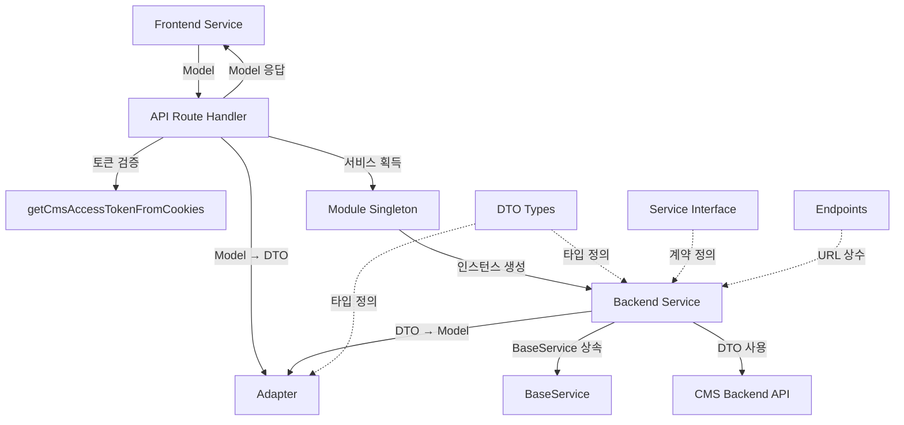

# Backend API Pattern

Next.js API Route Handler를 통해 CMS 백엔드와 통신하는 전체 구조와 패턴 가이드입니다.

## 목차

1. [개요](#1-개요)
2. [폴더 구조](#2-폴더-구조)
3. [API Route Handler](#3-api-route-handler)
4. [DTO (Data Transfer Object)](#4-dto-data-transfer-object)
5. [Adapter](#5-adapter)
6. [Module](#6-module)
7. [Backend Service](#7-backend-service)
8. [Service Interface](#8-service-interface)
9. [Endpoints](#9-endpoints)
10. [BaseService](#10-baseservice)
11. [베스트 프랙티스](#11-베스트-프랙티스)
12. [안티 패턴](#12-안티-패턴)
13. [체크리스트](#13-체크리스트)
14. [참고 자료](#14-참고-자료)

---

## 1. 개요

### 1.1 Rails Architecture 기반

이 프로젝트의 백엔드 API 계층은 **Rails Architecture** 원칙을 따릅니다. 데이터가 하나의 레일 위를 따라 예측 가능하게 흐르며, 각 계층은 명확한 책임을 가집니다.

### 1.2 계층별 책임

| 계층 | 책임 | 위치 |
|-----|-----|-----|
| **API Route Handler** | Next.js 엔드포인트, 토큰 검증, Adapter 호출 | `api/(cms)/.../route.ts` |
| **DTO** | 백엔드 API 데이터 구조 정의 | `api/_backend/modules/.../types/{domain}.dto.ts` |
| **Adapter** | DTO ↔ Model 양방향 변환 | `api/_backend/modules/.../types/{domain}.adapter.ts` |
| **Module** | 서비스 인스턴스 관리 (싱글톤) | `api/_backend/modules/.../{domain}.module.ts` |
| **Backend Service** | CMS API 호출, 비즈니스 로직 | `api/_backend/modules/.../{domain}.service.ts` |
| **Service Interface** | 서비스 계약 정의 | `api/_backend/modules/.../{domain}.service.interface.ts` |
| **Endpoints** | API URL 상수 관리 | `api/_backend/modules/.../{domain}.endpoints.ts` |
| **BaseService** | 공통 에러 처리, 토큰 관리 | `api/_backend/common/base.service.ts` |

### 1.3 계층 다이어그램



### 1.4 데이터 흐름

```
Frontend Service (Model)
  ↓
API Route Handler
  ↓ (Adapter: Model → DTO)
Module.getInstance().getService(token)
  ↓
Backend Service (extends BaseService)
  ↓ (fetch with DTO)
CMS Backend API
  ↓ (Response DTO)
Backend Service
  ↓ (Adapter: DTO → Model)
API Route Handler
  ↓ (Model Response)
Frontend Service
```

**핵심 원칙**:
- **Model Rail**: Frontend는 Model만 사용
- **DTO Rail**: Backend Service는 DTO만 사용
- **Adapter**: 두 레일 간의 변환기

---

## 2. 폴더 구조

```
api/
├── (cms)/                          # Next.js API Route Group
│   └── cms/(admin)/homepage/(brochure)/
│       ├── brochures/
│       │   └── route.ts           # API Route Handler
│       └── brochure-categories/
│           └── route.ts
│
└── _backend/                       # 백엔드 모듈
    ├── common/
    │   └── base.service.ts        # BaseService
    │
    └── modules/
        └── cms/admin/homepage/brochure/
            ├── brochure.module.ts          # Module (싱글톤)
            ├── brochure.service.ts         # Service 구현
            ├── brochure.service.interface.ts  # Service 계약
            ├── brochure.endpoints.ts       # 엔드포인트 상수
            └── types/
                ├── brochure.dto.ts         # DTO 정의
                └── brochure.adapter.ts     # Adapter 변환
```

### 폴더 구조 규칙

1. **API Route**: Next.js Route Group 패턴 사용
   - `(cms)`: 라우팅에 영향 없는 그룹
   - `route.ts`: HTTP 메서드 핸들러

2. **_backend**: 백엔드 관련 모듈 (프론트엔드에서 직접 접근 불가)
   - `common/`: 공통 유틸리티
   - `modules/`: 도메인별 모듈

3. **Domain 폴더**: 도메인별로 관련 파일 집중
   - `{domain}.module.ts`
   - `{domain}.service.ts`
   - `{domain}.service.interface.ts`
   - `{domain}.endpoints.ts`
   - `types/`: DTO, Adapter

---

## 3. API Route Handler

### 3.1 위치

`api/(cms)/cms/(admin)/homepage/(brochure)/*/route.ts`

### 3.2 역할

- Next.js API Route 엔드포인트 정의
- 쿠키에서 토큰 추출 및 검증
- URLSearchParams/Body를 Adapter로 변환
- Module을 통해 Service 획득
- 응답 반환 (Model 타입)

### 3.3 구현 패턴

```typescript
import { NextRequest, NextResponse } from "next/server";
import { BrochureModule } from "@/app/api/_backend/modules/cms/admin/homepage/brochure/brochure.module";
import { BrochureAdapter } from "@/app/api/_backend/modules/cms/admin/homepage/brochure/types/brochure.adapter";
import { getCmsAccessTokenFromCookies } from "@/lib/auth-utils.server";
import type { CreateBrochureModel } from "@/app/(planning)/plan/(cms)/cms/(admin)/homepage/brochure/_types/brochure.model";

export const dynamic = "force-dynamic";

// GET 핸들러
export async function GET(request: NextRequest) {
  // 1. 토큰 추출
  const cmsToken = getCmsAccessTokenFromCookies();

  // 2. 토큰 검증
  if (!cmsToken) {
    return NextResponse.json(
      { success: false, message: "CMS 인증이 필요합니다." },
      { status: 401 },
    );
  }

  const { searchParams } = new URL(request.url);

  // 3. Adapter로 변환 (Model → DTO)
  const cmsSearchParams = BrochureAdapter.toBrochuresRequest(searchParams);

  // 4. 모듈에서 서비스 획득
  const service = BrochureModule.getInstance().getBrochureService(cmsToken);
  const result = await service.getBrochures(cmsSearchParams);

  // 5. 응답 반환
  return NextResponse.json(result, {
    status: result.success ? 200 : 500,
  });
}

// POST 핸들러
export async function POST(request: NextRequest) {
  const cmsToken = getCmsAccessTokenFromCookies();
  if (!cmsToken) {
    return NextResponse.json(
      { success: false, message: "CMS 인증이 필요합니다." },
      { status: 401 },
    );
  }

  const body = await request.json();

  // Adapter로 Model → DTO 변환
  const createDto = BrochureAdapter.toCreateBrochureRequest(
    body as CreateBrochureModel,
  );

  const service = BrochureModule.getInstance().getBrochureService(cmsToken);
  const result = await service.createBrochure(createDto);

  return NextResponse.json(result, {
    status: result.success ? 201 : 500,
  });
}
```

### 3.4 핵심 포인트

1. **`export const dynamic = "force-dynamic"`**: 항상 동적 렌더링
2. **토큰 검증 우선**: 모든 요청에서 토큰 확인
3. **Adapter 사용 필수**: 직접 변환 금지
4. **Module을 통한 Service 획득**: 직접 생성 금지
5. **적절한 HTTP 상태 코드**: 성공 시 200/201, 실패 시 401/500

### 3.5 작성 체크리스트

- [ ] `export const dynamic = "force-dynamic"` 선언
- [ ] 토큰 추출 및 검증
- [ ] Adapter를 통한 Model ↔ DTO 변환
- [ ] Module을 통한 Service 획득
- [ ] 적절한 HTTP 상태 코드 반환
- [ ] JSDoc 주석 (엔드포인트, 설명)

---

## 4. DTO (Data Transfer Object)

### 4.1 위치

`_backend/modules/{system}/{role}/{domain}/types/{domain}.dto.ts`

### 4.2 역할

- CMS 백엔드 DTO와 1:1 매핑
- TypeScript 인터페이스로 정의
- 필드명은 백엔드와 동일하게 유지

### 4.3 구조

1. **응답 DTO** (Response DTO)
2. **요청 DTO** (Request DTO)
3. **조회 파라미터 DTO** (Query Params)

### 4.4 네이밍 규칙

| 타입 | 패턴 | 예시 |
|------|------|------|
| 응답 DTO | `{Domain}ResponseDto` | `BrochureResponseDto` |
| 목록 응답 DTO | `{Domain}ListResponseDto` | `BrochureListResponseDto` |
| 페이지 응답 DTO | `{Domain}PageResponseDto` | `BrochurePageResponseDto` |
| 생성 요청 DTO | `Create{Domain}Dto` | `CreateBrochureDto` |
| 수정 요청 DTO | `Update{Domain}Dto` | `UpdateBrochureDto` |
| 파라미터 DTO | `Get{Domain}sParams` | `GetBrochuresParams` |

### 4.5 코드 예시

```typescript
/**
 * 브로슈어 DTO 정의
 *
 * @description CMS 백엔드 DTO와 완전히 동일한 타입으로 정의합니다.
 * @see backend/cms/src/interface/common/dto/brochure/brochure-response.dto.ts
 */

// 응답 DTO
export interface BrochureResponseDto {
  id: string;
  isPublic: boolean;
  order: number;
  attachments: BrochureAttachmentDto[] | null;
  translations: BrochureTranslationResponseDto[];
  createdAt: string;
  updatedAt: string;
  createdBy: string | null;
  updatedBy: string | null;
}

export interface BrochureListResponseDto {
  items: BrochureListItemDto[];
  total: number;
  page: number;
  limit: number;
  totalPages: number;
}

export interface BrochurePageResponseDto {
  items: BrochureResponseDto[];
  page: number;
  limit: number;
  total: number;
  totalPages: number;
}

// 요청 DTO
export interface CreateBrochureDto {
  categoryId: string;
  translations: CreateBrochureTranslationDto[];
  createdBy?: string;
}

export interface UpdateBrochureDto {
  isPublic?: boolean;
  order?: number;
  attachments?: BrochureAttachmentDto[];
  translations?: UpdateBrochureTranslationDto[];
  updatedBy?: string;
}

// 파라미터 DTO
export interface GetBrochuresParams {
  isPublic?: boolean;
  orderBy?: "order" | "createdAt";
  page?: number;
  limit?: number;
}
```

### 4.6 작성 체크리스트

- [ ] 백엔드 DTO와 1:1 매핑 확인
- [ ] 필드명 동일성 확인
- [ ] JSDoc 주석 (설명, @see 백엔드 파일)
- [ ] Response/Request/Params 구분
- [ ] null 타입 명시 (백엔드와 동일)

---

## 5. Adapter

### 5.1 위치

`_backend/modules/{system}/{role}/{domain}/types/{domain}.adapter.ts`

### 5.2 역할

- DTO ↔ Model 양방향 변환
- 필드명 매핑 (예: `limit` ↔ `size`, `isActive` ↔ `isPublic`)
- 데이터 구조 변환

### 5.3 메서드 네이밍 패턴

| 변환 방향 | 패턴 | 입력 타입 | 출력 타입 | 설명 |
|----------|------|----------|----------|------|
| 단일 Response | `from{Domain}Response` | `{Domain}ResponseDto` | `{Domain}Model` | 단일 엔티티 응답 변환 |
| 배열 Response | `from{Domain}ListResponse` | `{Domain}ListResponseDto` | `{Domain}ListModel` | 배열 응답 변환 |
| 페이지 Response | `from{Domain}PageResponse` | `{Domain}PageResponseDto` | `{Domain}PageModel` | 페이지네이션 응답 변환 |
| Create 요청 | `toCreate{Domain}Request` | `Create{Domain}Model` | `Create{Domain}Dto` | 생성 요청 변환 |
| Update 요청 | `toUpdate{Domain}Request` | `Update{Domain}Model` | `Update{Domain}Dto` | 수정 요청 변환 |
| 액션 요청 | `toUpdate{Domain}{Action}Request` | `Update{Domain}{Action}Model` | `Update{Domain}{Action}Dto` | 특정 액션 요청 변환 |
| 하위 엔티티 | `from{SubEntity}Response` | `{SubEntity}ResponseDto` | `{SubEntity}Model` | 하위 엔티티 응답 변환 |
| URLSearchParams | `to{Domain}sRequest` | `URLSearchParams` | `URLSearchParams` | 쿼리 파라미터 변환 |

### 5.4 Private 메서드 네이밍 패턴

| 변환 방향 | 패턴 | 예시 | 설명 |
|----------|------|------|------|
| DTO 배열 → Model 배열 | `from{Entity}DtoArray` | `fromTranslationDtoArray` | 하위 엔티티 배열 변환 |
| DTO 항목 → Model | `from{Entity}Dto` | `fromPageDto` | 단일 DTO 항목 변환 |
| Model 배열 → DTO 배열 | `to{Entity}DtoArray` | `toTranslationDtoArray` | 하위 엔티티 배열 역변환 |

### 5.5 필드명 매핑 규칙

```typescript
// 백엔드 DTO → 프론트 Model
limit → size
isActive → isPublic
createdBy → authorId
fileName → name
fileUrl → url
fileSize → size
description → content (번역용)

// 프론트 Model → 백엔드 DTO
size → limit
isPublic → isActive
authorId → createdBy
name → fileName
url → fileUrl
size → fileSize
content → description
```

### 5.6 코드 예시

```typescript
/**
 * 브로슈어 어댑터
 *
 * @description DTO ↔ Model 양방향 변환
 *
 * [Response 변환] DTO → Model
 *   - fromBrochureResponse(): BrochureResponseDto → BrochureModel (단일)
 *   - fromBrochureListResponse(): BrochureListResponseDto → BrochuresModel (목록)
 *   - fromBrochurePageResponse(): BrochurePageResponseDto → BrochurePageModel (페이지네이션)
 *   - fromCategoryResponse(): BrochureCategoryResponseDto → BrochureCategoryModel (하위 엔티티)
 *
 * [Request 변환] Model → DTO
 *   - toBrochuresRequest(): URLSearchParams → URLSearchParams (쿼리 파라미터)
 *   - toCreateBrochureRequest(): CreateBrochureModel → CreateBrochureDto (생성)
 *   - toUpdateBrochureRequest(): UpdateBrochureModel → UpdateBrochureDto (수정)
 *   - toUpdateBrochurePublicRequest(): UpdateBrochurePublicModel → UpdateBrochurePublicDto (액션)
 *
 * [Private 메서드] 하위 엔티티/배열 변환
 *   - fromTranslationDtoArray(): TranslationDto[] → TranslationModel[]
 *   - fromAttachmentDtoArray(): AttachmentDto[] → AttachmentModel[]
 *   - fromPageDto(): PageDto → BrochureModel
 */
export class BrochureAdapter {
  // ============================================
  // Response 변환: DTO → Model
  // ============================================

  static fromBrochureResponse(dto: BrochureResponseDto): BrochureModel {
    const koTranslation = dto.translations.find((t) =>
      t.languageId.includes("ko"),
    );

    return {
      id: dto.id,
      code: "brochure",
      authorId: dto.createdBy ?? "",
      authorName: "",
      createdAt: dto.createdAt,
      updatedAt: dto.updatedAt,
      order: dto.order,
      isPublic: dto.isPublic,
      title: koTranslation?.title ?? dto.translations[0]?.title ?? "",
      translations: this.fromTranslationDtoArray(dto.translations, dto.id),
      attachments: this.fromAttachmentDtoArray(dto.attachments, dto.id),
    };
  }

  static fromBrochureListResponse(
    dto: BrochureListResponseDto,
  ): BrochuresModel {
    return {
      items: dto.items.map((item) => this.fromPageDto(item)),
      page: dto.page,
      size: dto.limit, // limit → size 변환
      total: dto.total,
      totalPages: dto.totalPages,
    };
  }

  static fromBrochurePageResponse(
    dto: BrochurePageResponseDto,
  ): BrochurePageModel {
    return {
      items: dto.items.map((item) => this.fromBrochureResponse(item)),
      pagination: {
        page: dto.page,
        size: dto.limit, // limit → size 변환
        total: dto.total,
        totalPages: dto.totalPages,
      },
    };
  }

  // ============================================
  // Request 변환: Model → DTO
  // ============================================

  static toBrochuresRequest(searchParams: URLSearchParams): URLSearchParams {
    const cmsParams = new URLSearchParams();

    // size → limit 변환
    const size = searchParams.get("size");
    if (size) {
      cmsParams.set("limit", size);
    }

    // 다른 파라미터는 그대로 복사
    const page = searchParams.get("page");
    if (page) cmsParams.set("page", page);

    return cmsParams;
  }

  static toCreateBrochureRequest(
    model: CreateBrochureModel,
  ): CreateBrochureDto {
    return {
      categoryId: model.category?.id ?? "",
      translations:
        model.translations?.map((t) => ({
          languageId: t.languageId,
          title: t.title,
          description: t.content, // content → description
        })) ?? [],
      createdBy: model.authorId,
    };
  }
}
```

### 5.7 작성 체크리스트

- [ ] 클래스 상단에 필드명 매핑 주석 작성
- [ ] Response 변환 메서드 구현 (from*)
- [ ] Request 변환 메서드 구현 (to*)
- [ ] Private 메서드 네이밍 규칙 준수
- [ ] null → undefined 변환 처리
- [ ] 필드명 매핑 정확히 수행

---

## 6. Module

### 6.1 위치

`_backend/modules/{system}/{role}/{domain}/{domain}.module.ts`

### 6.2 역할

- 싱글톤 패턴으로 서비스 인스턴스 관리
- API Route Handler에서 서비스 획득

### 6.3 구현 패턴

```typescript
import { BrochureService } from "./brochure.service";

/**
 * 브로슈어 모듈
 *
 * 싱글톤 패턴으로 BrochureService 인스턴스를 관리합니다.
 */
export class BrochureModule {
  private static instance: BrochureModule;

  private constructor() {}

  public static getInstance(): BrochureModule {
    if (!BrochureModule.instance) {
      BrochureModule.instance = new BrochureModule();
    }
    return BrochureModule.instance;
  }

  public getBrochureService(accessToken?: string): BrochureService {
    return new BrochureService(accessToken);
  }
}
```

### 6.4 핵심 포인트

1. **싱글톤 패턴**: `getInstance()` 메서드로 단일 인스턴스 보장
2. **Private Constructor**: 외부에서 직접 생성 불가
3. **Service Factory**: `get{Domain}Service()` 메서드로 서비스 생성
4. **토큰 전달**: 서비스 생성 시 accessToken 전달

### 6.5 작성 체크리스트

- [ ] 싱글톤 패턴 구현
- [ ] Private constructor 선언
- [ ] `getInstance()` 메서드 구현
- [ ] `get{Domain}Service()` 메서드 구현
- [ ] JSDoc 주석 작성

---

## 7. Backend Service

### 7.1 위치

`_backend/modules/{system}/{role}/{domain}/{domain}.service.ts`

### 7.2 역할

- BaseService 상속
- Interface 구현
- fetch를 통한 CMS 백엔드 API 호출
- Adapter를 통한 DTO → Model 변환

### 7.3 구현 패턴

```typescript
import {
  BaseService,
  ServiceResponse,
} from "@/app/api/_backend/common/base.service";
import { BrochureServiceInterface } from "./brochure.service.interface";
import { BROCHURE_ENDPOINTS } from "./brochure.endpoints";
import { BrochureAdapter } from "./types/brochure.adapter";
import type {
  BrochureResponseDto,
  CreateBrochureDto,
} from "./types/brochure.dto";
import type { BrochureModel } from "@/app/(planning)/plan/(cms)/cms/(admin)/homepage/brochure/_types/brochure.model";

export class BrochureService
  extends BaseService
  implements BrochureServiceInterface
{
  constructor(accessToken?: string) {
    super(accessToken);
  }

  async getBrochures(
    searchParams?: URLSearchParams,
  ): Promise<ServiceResponse<BrochuresModel>> {
    return this.handleApiCall(async () => {
      const queryString = searchParams?.toString() ?? "";
      const endpoint = queryString
        ? `${BROCHURE_ENDPOINTS.브로슈어_목록_조회}?${queryString}`
        : BROCHURE_ENDPOINTS.브로슈어_목록_조회;

      // fetch 호출
      const response = await fetch(endpoint, {
        method: "GET",
        headers: {
          "Content-Type": "application/json",
          Authorization: `Bearer ${this.accessToken}`,
        },
      });

      const result = await response.json();
      if (!response.ok) {
        throw new Error(result.message || "브로슈어 목록 조회 실패");
      }

      // Adapter를 통해 DTO → Model 변환
      return BrochureAdapter.fromBrochureListResponse(
        result as BrochureListResponseDto,
      );
    }, "브로슈어 목록 조회에 실패했습니다.");
  }

  async createBrochure(
    dto: CreateBrochureDto,
  ): Promise<ServiceResponse<BrochureModel>> {
    return this.handleApiCall(async () => {
      const response = await fetch(BROCHURE_ENDPOINTS.브로슈어_생성, {
        method: "POST",
        headers: {
          "Content-Type": "application/json",
          Authorization: `Bearer ${this.accessToken}`,
        },
        body: JSON.stringify(dto),
      });

      const result = await response.json();
      if (!response.ok) {
        throw new Error(result.message || "브로슈어 생성 실패");
      }

      return BrochureAdapter.fromBrochureResponse(
        result.data as BrochureResponseDto,
      );
    }, "브로슈어 생성에 실패했습니다.");
  }
}
```

### 7.4 핵심 포인트

1. **BaseService 상속**: 공통 기능 재사용
2. **Interface 구현**: 타입 안정성
3. **handleApiCall 사용**: 에러 처리 자동화
4. **Adapter 사용**: DTO → Model 변환
5. **Endpoints 사용**: URL 하드코딩 금지

### 7.5 작성 체크리스트

- [ ] BaseService 상속
- [ ] Interface 구현
- [ ] Constructor에서 super(accessToken) 호출
- [ ] handleApiCall로 메서드 래핑
- [ ] Adapter를 통한 변환 수행
- [ ] Endpoints 상수 사용
- [ ] Authorization 헤더 설정

---

## 8. Service Interface

### 8.1 위치

`_backend/modules/{system}/{role}/{domain}/{domain}.service.interface.ts`

### 8.2 역할

- 서비스 계약 정의
- 백엔드 Controller와 1:1 매핑
- 응답 타입은 Model 사용

### 8.3 구현 패턴

```typescript
import type { ServiceResponse } from "@/app/api/_backend/common/base.service";
import type {
  BrochureModel,
  BrochuresModel,
} from "@/app/(planning)/plan/(cms)/cms/(admin)/homepage/brochure/_types/brochure.model";
import type {
  CreateBrochureDto,
  UpdateBrochureDto,
} from "./types/brochure.dto";

/**
 * 브로슈어 서비스 인터페이스
 *
 * @description 백엔드 Controller와 1:1 매핑되는 메서드 시그니처 정의
 * @see backend/cms/src/interface/admin/brochure/brochure.controller.ts
 */
export interface BrochureServiceInterface {
  /**
   * 브로슈어 목록을 조회한다
   * @endpoint GET /admin/brochures
   */
  getBrochures(
    searchParams?: URLSearchParams,
  ): Promise<ServiceResponse<BrochuresModel>>;

  /**
   * 브로슈어를 생성한다
   * @endpoint POST /admin/brochures
   */
  createBrochure(
    dto: CreateBrochureDto,
  ): Promise<ServiceResponse<BrochureModel>>;

  /**
   * 브로슈어를 수정한다
   * @endpoint PUT /admin/brochures/:id
   */
  updateBrochure(
    id: string,
    dto: UpdateBrochureDto,
  ): Promise<ServiceResponse<BrochureModel>>;

  /**
   * 브로슈어를 삭제한다
   * @endpoint DELETE /admin/brochures/:id
   */
  deleteBrochure(id: string): Promise<ServiceResponse<{ deleted: boolean }>>;
}
```

### 8.4 핵심 포인트

1. **백엔드 Controller 1:1 매핑**: 메서드명 및 시그니처 동일
2. **ServiceResponse 래핑**: 모든 반환 타입
3. **Model 타입 사용**: 응답은 Model, 요청은 DTO
4. **JSDoc 주석**: 설명, @endpoint, @see

### 8.5 작성 체크리스트

- [ ] 백엔드 Controller 참조 (@see)
- [ ] 모든 메서드에 JSDoc 주석
- [ ] @endpoint 태그로 HTTP 메서드 및 경로 명시
- [ ] ServiceResponse로 반환 타입 래핑
- [ ] 요청은 DTO, 응답은 Model 타입

---

## 9. Endpoints

### 9.1 위치

`_backend/modules/{system}/{role}/{domain}/{domain}.endpoints.ts`

### 9.2 역할

- API 엔드포인트 URL 상수 정의
- BASE_URL 환경변수 사용
- 동적 경로 함수 제공

### 9.3 구현 패턴

```typescript
/**
 * 브로슈어 API 엔드포인트 상수
 */

const BASE_URL = process.env.NEXT_PUBLIC_CMS_API_URL || "http://localhost:4000";

const createApiPath = (path: string) => `${BASE_URL}${path}`;

const createDynamicApiPath = (path: string) => (id: string) =>
  createApiPath(path.replace("{id}", id));

export const BROCHURE_ENDPOINTS = {
  // 브로슈어 CRUD
  브로슈어_목록_조회: createApiPath("/api/admin/brochures"),
  브로슈어_전체_목록_조회: createApiPath("/api/admin/brochures/all"),
  브로슈어_상세_조회: createDynamicApiPath("/api/admin/brochures/{id}"),
  브로슈어_생성: createApiPath("/api/admin/brochures"),
  브로슈어_수정: createDynamicApiPath("/api/admin/brochures/{id}"),
  브로슈어_삭제: createDynamicApiPath("/api/admin/brochures/{id}"),

  // 브로슈어 액션
  브로슈어_공개_수정: createDynamicApiPath("/api/admin/brochures/{id}/public"),
  브로슈어_순서_수정: createApiPath("/api/admin/brochures/batch-order"),
} as const;

export type BrochureEndpoints = typeof BROCHURE_ENDPOINTS;
```

### 9.4 핵심 포인트

1. **환경변수 사용**: BASE_URL을 env에서 가져옴
2. **헬퍼 함수**: `createApiPath`, `createDynamicApiPath`
3. **한글 키**: 도메인 용어로 직관적 표현
4. **as const**: 타입 추론을 위한 상수 객체
5. **타입 export**: `BrochureEndpoints` 타입 제공

### 9.5 작성 체크리스트

- [ ] BASE_URL 환경변수 사용
- [ ] createApiPath 헬퍼 함수 정의
- [ ] createDynamicApiPath 헬퍼 함수 정의
- [ ] 한글 키 사용
- [ ] `as const` 선언
- [ ] 타입 export

---

## 10. BaseService

### 10.1 위치

`_backend/common/base.service.ts`

### 10.2 역할

- 공통 에러 처리
- ServiceResponse 타입 정의
- 토큰 관리

### 10.3 구현

```typescript
export interface ServiceResponse<T = unknown> {
  success: boolean;
  message?: string;
  statusCode?: number;
  data?: T;
}

export abstract class BaseService {
  protected accessToken: string;

  constructor(accessToken?: string) {
    this.accessToken = accessToken ?? "";
  }

  protected async handleApiCall<T>(
    operation: () => Promise<T>,
    errorMessage: string,
  ): Promise<ServiceResponse<T>> {
    try {
      const result = await operation();
      return {
        success: true,
        data: result,
      };
    } catch (error: unknown) {
      return {
        success: false,
        message: error instanceof Error ? error.message : errorMessage,
      };
    }
  }
}
```

### 10.4 핵심 포인트

1. **ServiceResponse**: 통일된 응답 형식
2. **accessToken 관리**: protected 필드
3. **handleApiCall**: try-catch 자동 처리
4. **에러 메시지**: 원본 에러 또는 기본 메시지

### 10.5 사용 예시

```typescript
// Service에서 사용
async getBrochures(): Promise<ServiceResponse<BrochuresModel>> {
  return this.handleApiCall(async () => {
    // API 호출 로직
    const response = await fetch(endpoint);
    return BrochureAdapter.fromBrochureListResponse(result);
  }, "브로슈어 목록 조회에 실패했습니다.");
}
```

---

## 11. 베스트 프랙티스

### 11.1 계층별 책임 분리

각 계층은 명확한 단일 책임을 가집니다.

```typescript
// ✅ 올바른 예시
// API Handler: 토큰 검증, Adapter 호출, Service 획득
export async function GET(request: NextRequest) {
  const token = getCmsAccessTokenFromCookies();
  if (!token) return unauthorized();
  
  const params = BrochureAdapter.toBrochuresRequest(searchParams);
  const service = BrochureModule.getInstance().getBrochureService(token);
  return service.getBrochures(params);
}

// ❌ 잘못된 예시: Handler에서 직접 fetch
export async function GET(request: NextRequest) {
  const response = await fetch("https://cms.example.com/api/brochures");
  // ...
}
```

### 11.2 Adapter 패턴 엄수

DTO ↔ Model 변환은 항상 Adapter를 통해서만 수행합니다.

```typescript
// ✅ 올바른 예시
const model = BrochureAdapter.fromBrochureResponse(dto);

// ❌ 잘못된 예시: 수동 변환
const model = {
  id: dto.id,
  size: dto.limit, // 수동 매핑
  // ...
};
```

### 11.3 싱글톤 Module 사용

서비스 인스턴스는 항상 Module을 통해 획득합니다.

```typescript
// ✅ 올바른 예시
const service = BrochureModule.getInstance().getBrochureService(token);

// ❌ 잘못된 예시: 직접 생성
const service = new BrochureService(token);
```

### 11.4 BaseService 상속

모든 Backend Service는 BaseService를 상속합니다.

```typescript
// ✅ 올바른 예시
export class BrochureService extends BaseService implements BrochureServiceInterface {
  constructor(accessToken?: string) {
    super(accessToken);
  }
  
  async getBrochures(): Promise<ServiceResponse<BrochuresModel>> {
    return this.handleApiCall(async () => {
      // ...
    }, "에러 메시지");
  }
}

// ❌ 잘못된 예시: BaseService 미상속
export class BrochureService {
  async getBrochures() {
    try {
      // 중복된 에러 처리 로직
    } catch (error) {
      // ...
    }
  }
}
```

### 11.5 한글 엔드포인트명

도메인 로직을 직관적으로 표현합니다.

```typescript
// ✅ 올바른 예시
export const BROCHURE_ENDPOINTS = {
  브로슈어_목록_조회: createApiPath("/api/admin/brochures"),
  브로슈어_생성: createApiPath("/api/admin/brochures"),
};

// ❌ 잘못된 예시: 영문 또는 축약
export const BROCHURE_ENDPOINTS = {
  getBrochures: createApiPath("/api/admin/brochures"),
  create: createApiPath("/api/admin/brochures"),
};
```

### 11.6 타입 안정성

DTO와 Model 모두 명시적인 TypeScript 타입을 사용합니다.

```typescript
// ✅ 올바른 예시
async createBrochure(
  dto: CreateBrochureDto
): Promise<ServiceResponse<BrochureModel>> {
  // ...
}

// ❌ 잘못된 예시: any 또는 unknown 남용
async createBrochure(dto: any): Promise<any> {
  // ...
}
```

---

## 12. 안티 패턴

### 12.1 Handler에서 직접 DTO 사용

```typescript
// ❌ 안티 패턴
export async function POST(request: NextRequest) {
  const body = await request.json();
  // Adapter 거치지 않고 직접 DTO 생성
  const dto: CreateBrochureDto = {
    categoryId: body.categoryId,
    translations: body.translations,
  };
  // ...
}

// ✅ 올바른 패턴
export async function POST(request: NextRequest) {
  const body = await request.json();
  const dto = BrochureAdapter.toCreateBrochureRequest(body as CreateBrochureModel);
  // ...
}
```

### 12.2 Service에서 Model 타입 직접 사용

```typescript
// ❌ 안티 패턴
export class BrochureService {
  async createBrochure(model: CreateBrochureModel) {
    // Service는 DTO만 사용해야 함
    const response = await fetch(endpoint, {
      body: JSON.stringify(model),
    });
  }
}

// ✅ 올바른 패턴
export class BrochureService {
  async createBrochure(dto: CreateBrochureDto) {
    const response = await fetch(endpoint, {
      body: JSON.stringify(dto),
    });
  }
}
```

### 12.3 Adapter 없이 수동 변환

```typescript
// ❌ 안티 패턴
const model = {
  id: dto.id,
  size: dto.limit,
  isPublic: dto.isActive,
  // 수동 매핑은 유지보수 어려움
};

// ✅ 올바른 패턴
const model = BrochureAdapter.fromBrochureResponse(dto);
```

### 12.4 Module 없이 Service 직접 생성

```typescript
// ❌ 안티 패턴
const service = new BrochureService(token);

// ✅ 올바른 패턴
const service = BrochureModule.getInstance().getBrochureService(token);
```

### 12.5 BaseService 상속하지 않음

```typescript
// ❌ 안티 패턴
export class BrochureService {
  async getBrochures() {
    try {
      // 모든 Service마다 중복된 에러 처리
      const response = await fetch(endpoint);
      if (!response.ok) throw new Error();
      return { success: true, data: result };
    } catch (error) {
      return { success: false, message: "..." };
    }
  }
}

// ✅ 올바른 패턴
export class BrochureService extends BaseService {
  async getBrochures() {
    return this.handleApiCall(async () => {
      const response = await fetch(endpoint);
      if (!response.ok) throw new Error();
      return result;
    }, "에러 메시지");
  }
}
```

---

## 13. 체크리스트

### 13.1 API Route Handler

- [ ] `export const dynamic = "force-dynamic"` 선언
- [ ] `getCmsAccessTokenFromCookies()`로 토큰 추출
- [ ] 토큰 검증 (401 반환)
- [ ] Adapter를 통한 변환 수행
- [ ] Module.getInstance()로 서비스 획득
- [ ] 적절한 HTTP 상태 코드 반환 (200/201/401/500)
- [ ] JSDoc 주석 작성

### 13.2 DTO

- [ ] 백엔드 DTO와 1:1 매핑 확인
- [ ] 필드명 동일성 확인
- [ ] Response/Request/Params 타입 분리
- [ ] null 타입 명시 (백엔드와 동일)
- [ ] JSDoc 주석 (@description, @see)
- [ ] 네이밍 규칙 준수

### 13.3 Adapter

- [ ] 클래스 상단에 필드명 매핑 주석
- [ ] Response 변환 메서드 (from*)
- [ ] Request 변환 메서드 (to*)
- [ ] Private 메서드 네이밍 규칙 준수
- [ ] null → undefined 변환
- [ ] 필드명 매핑 정확히 수행
- [ ] JSDoc 주석 작성

### 13.4 Module

- [ ] 싱글톤 패턴 구현
- [ ] Private constructor
- [ ] `getInstance()` 메서드
- [ ] `get{Domain}Service()` 메서드
- [ ] JSDoc 주석 작성

### 13.5 Backend Service

- [ ] BaseService 상속
- [ ] Interface 구현
- [ ] Constructor에서 super(accessToken) 호출
- [ ] handleApiCall로 메서드 래핑
- [ ] Adapter를 통한 DTO → Model 변환
- [ ] Endpoints 상수 사용
- [ ] Authorization 헤더 설정

### 13.6 Service Interface

- [ ] 백엔드 Controller 참조 (@see)
- [ ] 모든 메서드에 JSDoc 주석
- [ ] @endpoint 태그 명시
- [ ] ServiceResponse로 반환 타입 래핑
- [ ] 요청 DTO, 응답 Model 타입

### 13.7 Endpoints

- [ ] BASE_URL 환경변수 사용
- [ ] createApiPath 헬퍼 함수
- [ ] createDynamicApiPath 헬퍼 함수
- [ ] 한글 키 사용
- [ ] `as const` 선언
- [ ] 타입 export

---

## 14. 참고 자료

### 14.1 관련 스킬

- [Rails Architecture](../rails-architecture/SKILL.md): 데이터 흐름 및 레일 개념
- [Adapter Design Pattern](../adapter-design-pattern/SKILL.md): Adapter 상세 가이드
- [Frontend Design Pattern](../frontend-design-pattern/SKILL.md): Frontend 계층 패턴
- [API Flow Debugger](../api-flow-debugger/SKILL.md): 타입 불일치 디버깅

### 14.2 실제 코드 예시

| 계층 | 파일 경로 |
|------|----------|
| Handler | `api/(cms)/cms/(admin)/homepage/(brochure)/brochures/route.ts` |
| DTO | `api/_backend/modules/cms/admin/homepage/brochure/types/brochure.dto.ts` |
| Adapter | `api/_backend/modules/cms/admin/homepage/brochure/types/brochure.adapter.ts` |
| Module | `api/_backend/modules/cms/admin/homepage/brochure/brochure.module.ts` |
| Service | `api/_backend/modules/cms/admin/homepage/brochure/brochure.service.ts` |
| Interface | `api/_backend/modules/cms/admin/homepage/brochure/brochure.service.interface.ts` |
| Endpoints | `api/_backend/modules/cms/admin/homepage/brochure/brochure.endpoints.ts` |
| BaseService | `api/_backend/common/base.service.ts` |

### 14.3 규칙

- [Naming Convention](../../../../.cursor/rules/naming-convention.mdc): 네이밍 규칙
- [Temporal API](../../../../.cursor/rules/temporal-api.mdc): 날짜/시간 처리

### 14.4 외부 리소스

- [Next.js API Routes](https://nextjs.org/docs/app/building-your-application/routing/route-handlers)
- [TypeScript Handbook](https://www.typescriptlang.org/docs/handbook/)
- [Adapter Pattern](https://refactoring.guru/design-patterns/adapter)
- [Singleton Pattern](https://refactoring.guru/design-patterns/singleton)

---

## 15. FAQ

### Q1. Adapter와 Mapper의 차이는?

**Adapter**:
- 위치: `api/_backend/modules/.../types/{domain}.adapter.ts`
- 역할: Backend API 도메인(DTO) ↔ Frontend 도메인(Model) 변환
- 필드명 매핑 수행 (예: `limit` ↔ `size`)

**Mapper**:
- 위치: `(current)/(cms)/.../_types/{domain}.mapper.ts`
- 역할: Model ↔ Presenter 변환
- 필드명 매핑 없음 (동일 도메인)

### Q2. 언제 Module을 사용하나요?

항상 사용합니다. API Handler에서 Service를 획득할 때 Module을 통해야 합니다.

```typescript
// ✅ 항상 Module 사용
const service = BrochureModule.getInstance().getBrochureService(token);

// ❌ 직접 생성 금지
const service = new BrochureService(token);
```

### Q3. DTO와 Model의 차이는?

**DTO** (Data Transfer Object):
- 백엔드 API와 통신하는 데이터 구조
- 필드명이 백엔드와 완전히 동일
- `api/_backend/modules/.../types/{domain}.dto.ts`

**Model**:
- 프론트엔드에서 사용하는 데이터 구조
- UI에 최적화된 필드명
- `(current)/(cms)/.../_types/{domain}.model.ts`

### Q4. 페이지네이션 필드명 매핑은?

| Frontend | Backend | 설명 |
|----------|---------|------|
| `page` | `page` | 페이지 번호 |
| `size` | `limit` | 페이지 크기 |
| `total` | `total` | 전체 항목 수 |
| `totalPages` | `totalPages` | 전체 페이지 수 |

### Q5. 에러 처리는 어떻게 하나요?

BaseService의 `handleApiCall`이 자동으로 처리합니다.

```typescript
async createBrochure(dto: CreateBrochureDto) {
  return this.handleApiCall(async () => {
    const response = await fetch(endpoint, {...});
    if (!response.ok) {
      throw new Error("에러 발생"); // handleApiCall이 catch
    }
    return result;
  }, "기본 에러 메시지");
}
```

---

**마지막 업데이트:** 2026-01-23  
**문서 버전:** 1.0.0  
**작성자:** AI Agent
