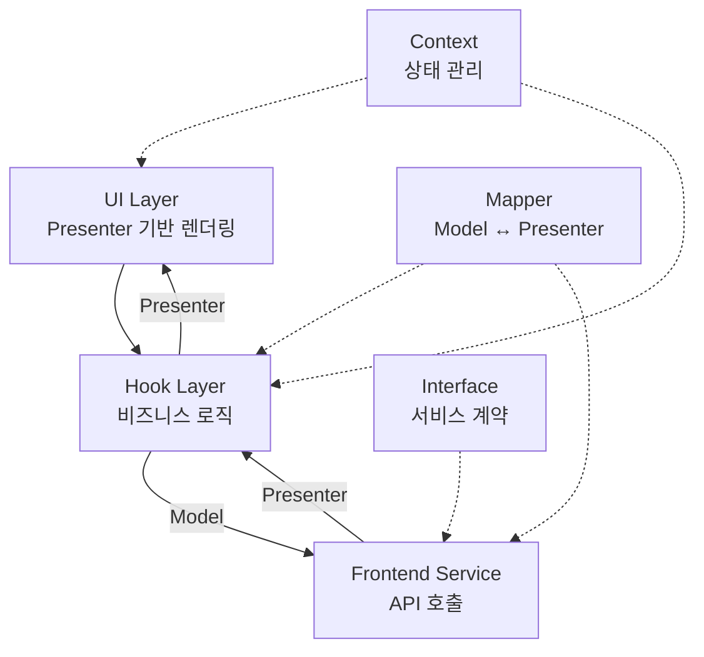

# Frontend Design Pattern

> 프론트엔드 계층별 코드 작성 가이드라인

## 목차

1. [개요](#개요)
2. [아키텍처 구조](#아키텍처-구조)
3. [Model 작성 가이드](#model-작성-가이드)
4. [Presenter 작성 가이드](#presenter-작성-가이드)
5. [Interface 작성 가이드](#interface-작성-가이드)
6. [Mapper 작성 가이드](#mapper-작성-가이드)
7. [Service 작성 가이드](#service-작성-가이드)
8. [Context 작성 가이드](#context-작성-가이드)
9. [Hooks 작성 가이드](#hooks-작성-가이드)
10. [UI 컴포넌트 작성 가이드](#ui-컴포넌트-작성-가이드)
11. [베스트 프랙티스](#베스트-프랙티스)
12. [안티 패턴](#안티-패턴)
13. [체크리스트](#체크리스트)
14. [참고 자료](#참고-자료)

---

## 개요

이 문서는 Lumir Portal 프론트엔드 코드베이스의 계층별 작성 가이드라인을 제공합니다. Rails Architecture 철학을 따르는 명확한 계층 구조와 일관된 네이밍 컨벤션을 통해 유지보수성과 확장성을 보장합니다.

### 핵심 철학

**"데이터는 하나의 레일(rail) 위를 따라 흐른다"**

프론트엔드의 각 계층은 정해진 역할과 책임을 가지며, 데이터는 명확한 타입(Presenter, Model)을 통해 예측 가능하게 흐릅니다.

### 주요 특징

- **타입 안정성**: Model 기반의 강력한 타입 시스템
- **불변성 패턴**: Presenter의 `copyWith()` 메서드
- **명확한 책임 분리**: 각 계층의 독립적인 역할
- **한글 메서드명**: 도메인 로직의 직관적 표현
- **Mock/Real 전환**: Service Context를 통한 유연한 구현 교체

---

## 아키텍처 구조

### 계층 다이어그램



### 데이터 흐름

```
사용자 인터랙션
  ↓
UI Component (Presenter 사용)
  ↓
Hook (Presenter → Model 변환)
  ↓
Frontend Service (Model 입력/Presenter 출력)
  ↓
Next.js API Route
  ↓
Backend Service
```

### 폴더 구조

```
{domain}/
├── _types/              # 타입 정의
│   ├── {domain}.model.ts       # UI 데이터 구조 명세
│   ├── {domain}.presenter.ts   # UI 헬퍼 + 불변성 관리
│   ├── {domain}-category.presenter.ts
│   └── {domain}-translation.presenter.ts
│
├── _services/           # 서비스 계층
│   ├── {domain}.interface.ts   # 서비스 계약 (한글 메서드명)
│   ├── {domain}.mapper.ts      # Model ↔ Presenter 변환
│   └── {domain}.service.ts     # 비즈니스 로직 + API 호출
│
├── _context/            # 상태 관리
│   ├── {Domain}Context.tsx         # 일반 상태 관리
│   └── {Domain}ServiceContext.tsx  # 서비스 DI
│
├── _hooks/              # 커스텀 훅
│   └── _action/
│       ├── useCreate{Domain}.ts
│       ├── useRead{Domain}s.ts
│       ├── useUpdate{Domain}.ts
│       └── useDelete{Domain}.ts
│
└── _ui/                 # UI 컴포넌트
    ├── {Domain}Content.section.tsx
    ├── {Domain}List.section/
    │   ├── index.tsx
    │   └── _ui/
    │       ├── {Domain}Table.module.tsx
    │       └── Pagination.module.tsx
    └── {Domain}Form.section.tsx
```

---

## Model 작성 가이드

### 개요

Model은 UI 계층의 **데이터 구조 명세(타입 계약)**입니다. DTO와는 독립적으로 정의되어 UI 요구사항 변화에 유연하게 대응합니다.

### 위치

```
{domain}/_types/{domain}.model.ts
```

### 역할

- Presenter가 가져야 할 필드 구조 정의
- UI 계층의 타입 안정성 확보
- DTO와의 독립성 유지

### 구조

Model 파일은 다음 섹션으로 구성됩니다:

1. **기본 모델**: 도메인 엔티티 인터페이스
2. **관계 모델**: Category, Translation, Attachment 등
3. **Create/Update 모델**: 생성/수정 요청용
4. **파라미터 모델**: 목록 조회 필터/페이징
5. **응답 모델**: 페이지네이션 포함 목록

### 네이밍 규칙

| 타입 | 패턴 | 예시 |
|------|------|------|
| 기본 모델 | `{Domain}Model` | `IrModel` |
| 관계 모델 | `{Domain}{Relation}Model` | `IrCategoryModel` |
| 생성 모델 | `Create{Domain}Model` | `CreateIrModel` |
| 수정 모델 | `Update{Domain}Model` | `UpdateIrModel` |
| 파라미터 모델 | `{Domain}ListParams` | `IrListParams` |
| 응답 모델 | `{Domain}sModel` | `IrsModel` |

### 코드 예시

```typescript
/**
 * IR 문서의 핵심 데이터 모델
 *
 * @remarks
 * - 관계: N:1 → IrCategoryModel
 * - 관계: 1:N → IrTranslationModel
 */
export interface IrModel {
  /** 문서 고유 ID (Primary Key) */
  id: string;

  /** CMS 문서 타입 코드 */
  code: Extract<DocumentCode, "ir">;

  /** 작성자 ID */
  authorId: string;

  /** 작성자 이름 */
  authorName: string;

  /** 생성 일시 (ISO 8601) */
  createdAt: string;

  /** 수정 일시 (ISO 8601) */
  updatedAt: string;

  /** 발행 일시 (선택적) */
  publishedAt?: string;

  /** 정렬 순서 */
  order?: number;

  /** 공개 여부 */
  isPublic?: boolean;

  /** 문서 제목 */
  title: string;

  /** 첨부파일 목록 (1:N) */
  attachments?: IrAttachmentModel[];

  /** 문서 번역 목록 (1:N) */
  translations?: IrTranslationModel[];

  /** 카테고리 정보 (N:1) */
  category?: IrCategoryModel;
}

/**
 * IR 생성 요청 모델
 */
export interface CreateIrModel {
  code: Extract<DocumentCode, "ir">;
  authorId: string;
  authorName: string;
  publishedAt?: string;
  order?: number;
  isPublic?: boolean;
  title: string;
  attachments?: CreateIrAttachmentModel[];
  translations?: IrTranslationModel[];
  category?: IrCategoryModel;
}

/**
 * IR 수정 요청 모델 (부분 업데이트 지원)
 */
export interface UpdateIrModel {
  authorId?: string;
  authorName?: string;
  publishedAt?: string;
  order?: number;
  isPublic?: boolean;
  title?: string;
  attachments?: IrAttachmentModel[];
  translations?: IrTranslationModel[];
  category?: IrCategoryModel;
}

/**
 * IR 목록 조회 파라미터 모델
 */
export interface IrListParams {
  /** 페이지 번호 (1부터 시작) */
  page?: number;

  /** 페이지 크기 */
  size?: number;

  /** 카테고리 ID 필터 */
  categoryId?: string;

  /** 검색 키워드 */
  keyword?: string;

  /** 공개 여부 필터 */
  isPublic?: boolean;
}

/**
 * IR 목록 모델 (페이지네이션 포함)
 */
export interface IrsModel {
  /** 현재 페이지의 IR 목록 */
  items: IrModel[];

  /** 현재 페이지 번호 */
  page: number;

  /** 페이지 크기 */
  size: number;

  /** 전체 아이템 수 */
  total: number;

  /** 전체 페이지 수 */
  totalPages: number;
}
```

### 작성 체크리스트

- [ ] 모든 필드에 JSDoc 주석 추가
- [ ] 관계 필드에 `@remarks` 주석으로 관계 명시
- [ ] Primary Key에 `(Primary Key)` 명시
- [ ] Foreign Key에 관계 정보 명시
- [ ] 타임스탬프는 `string` 타입 (ISO 8601)
- [ ] 선택적 필드는 `?` 사용
- [ ] Create 모델에서 서버 생성 필드(id, createdAt, updatedAt) 제외
- [ ] Update 모델은 모든 필드 선택적으로 정의

---

## Presenter 작성 가이드

### 개요

Presenter는 Model을 구현하며 **UI 헬퍼 메서드**와 **불변성 관리** 기능을 제공하는 클래스입니다.

### 위치

```
{domain}/_types/{domain}.presenter.ts
```

### 역할

- Model 인터페이스 구현 (`implements {Domain}Model`)
- UI 계층에서 사용하는 헬퍼 메서드 제공
- 불변성 패턴 구현 (`copyWith`)
- 데이터 포맷팅 및 변환

### 필수 메서드

| 메서드 | 타입 | 설명 |
|--------|------|------|
| `static create()` | 팩토리 | 데이터로부터 인스턴스 생성 |
| `static createEmpty()` | 팩토리 | 빈 인스턴스 생성 (폼 초기화용) |
| `copyWith()` | 인스턴스 | 불변성 유지하며 일부 속성 변경 |

### UI 헬퍼 메서드 패턴

#### 1. display{속성}() 패턴

표시용 문자열을 반환합니다.

```typescript
/**
 * UI 헬퍼 메서드: 작성일 포맷팅 반환
 */
static displayCreatedAt(createdAt?: string): string {
  return createdAt ? formatDate(createdAt) : "-";
}

/**
 * 인스턴스 메서드 버전
 */
displayCreatedAt(): string {
  return IrPresenter.displayCreatedAt(this.createdAt);
}
```

#### 2. get{속성}() 패턴

특정 조건의 값을 반환합니다.

```typescript
/**
 * 특정 언어의 번역 가져오기
 */
getTranslation(languageId: string): IrTranslationPresenter | undefined {
  return IrTranslationPresenter.getTranslation(
    this.translations || [],
    languageId
  );
}

/**
 * 특정 언어의 제목 가져오기 (fallback 지원)
 */
getTitle(languageId: string, fallbackLanguageId?: string): string {
  return IrTranslationPresenter.getTitle(
    this.translations || [],
    languageId,
    fallbackLanguageId
  );
}
```

### 코드 예시

```typescript
/**
 * IR 문서 Presenter 클래스
 *
 * @description
 * - UI 계층에서 데이터를 다루기 위한 최적화된 클래스
 * - UI 헬퍼 메서드를 포함하여 컴포넌트의 가독성을 높임
 */
export class IrPresenter implements IrModel {
  // Model 명세에 따른 필드 정의 (readonly)
  readonly id: string;
  readonly code: Extract<DocumentCode, "ir">;
  readonly authorId: string;
  readonly authorName: string;
  readonly createdAt: string;
  readonly updatedAt: string;
  readonly publishedAt?: string;
  readonly order?: number;
  readonly isPublic?: boolean;
  readonly title: string;

  // 관계 필드
  readonly category?: IrCategoryPresenter;
  readonly translations?: IrTranslationPresenter[];

  private constructor(data: {
    id: string;
    code: Extract<DocumentCode, "ir">;
    authorId: string;
    authorName: string;
    createdAt: string;
    updatedAt: string;
    publishedAt?: string;
    order?: number;
    isPublic?: boolean;
    title: string;
    category?: IrCategoryPresenter;
    translations?: IrTranslationPresenter[];
  }) {
    this.id = data.id;
    this.code = data.code;
    this.authorId = data.authorId;
    this.authorName = data.authorName;
    this.createdAt = data.createdAt;
    this.updatedAt = data.updatedAt;
    this.publishedAt = data.publishedAt;
    this.order = data.order;
    this.isPublic = data.isPublic;
    this.title = data.title;
    this.category = data.category;
    this.translations = data.translations;
  }

  /**
   * 팩토리 메서드: 데이터로부터 Presenter 인스턴스 생성
   */
  static create(data: {
    id: string;
    code: Extract<DocumentCode, "ir">;
    authorId: string;
    authorName: string;
    createdAt: string;
    updatedAt: string;
    publishedAt?: string;
    order?: number;
    isPublic?: boolean;
    title: string;
    category?: IrCategoryPresenter;
    translations?: IrTranslationPresenter[];
  }): IrPresenter {
    return new IrPresenter(data);
  }

  /**
   * 빈 IR Presenter 생성 (폼 초기화용)
   */
  static createEmpty(): IrPresenter {
    return IrPresenter.create({
      id: "",
      code: "ir",
      authorId: "",
      authorName: "",
      createdAt: nowISOString(),
      updatedAt: nowISOString(),
      title: "",
      isPublic: false,
    });
  }

  /**
   * 불변성을 유지하면서 일부 속성만 변경한 새 인스턴스 생성
   */
  copyWith(updates: Partial<IrPresenter>): IrPresenter {
    return IrPresenter.create({
      id: updates.id ?? this.id,
      code: (updates.code ?? this.code) as Extract<DocumentCode, "ir">,
      authorId: updates.authorId ?? this.authorId,
      authorName: updates.authorName ?? this.authorName,
      createdAt: updates.createdAt ?? this.createdAt,
      updatedAt: updates.updatedAt ?? this.updatedAt,
      publishedAt: updates.publishedAt ?? this.publishedAt,
      order: updates.order ?? this.order,
      isPublic: updates.isPublic ?? this.isPublic,
      title: updates.title ?? this.title,
      category: updates.category ?? this.category,
      translations: (updates.translations ?? this.translations) as
        | IrTranslationPresenter[]
        | undefined,
    });
  }

  // ============= UI 헬퍼 메서드 (Static) =============

  static displayAuthor(authorName?: string): string {
    return authorName || "-";
  }

  static displayCreatedAt(createdAt?: string): string {
    return createdAt ? formatDate(createdAt) : "-";
  }

  static displayPublicStatus(isPublic?: boolean): string {
    return isPublic ? "공개" : "비공개";
  }

  // ============= UI 헬퍼 메서드 (Instance) =============

  displayAuthor(): string {
    return IrPresenter.displayAuthor(this.authorName);
  }

  displayCreatedAt(): string {
    return IrPresenter.displayCreatedAt(this.createdAt);
  }

  displayPublicStatus(): string {
    return IrPresenter.displayPublicStatus(this.isPublic);
  }

  // ============= 데이터 접근 헬퍼 =============

  getTranslation(languageId: string): IrTranslationPresenter | undefined {
    return IrTranslationPresenter.getTranslation(
      this.translations || [],
      languageId
    );
  }

  getTitle(languageId: string, fallbackLanguageId?: string): string {
    return IrTranslationPresenter.getTitle(
      this.translations || [],
      languageId,
      fallbackLanguageId
    );
  }
}
```

### 작성 체크리스트

- [ ] `implements {Domain}Model` 선언
- [ ] 모든 필드를 `readonly`로 선언
- [ ] `private constructor` 사용
- [ ] `static create()` 팩토리 메서드 구현
- [ ] `static createEmpty()` 구현
- [ ] `copyWith()` 메서드 구현
- [ ] UI 헬퍼 메서드는 Static/Instance 버전 모두 제공
- [ ] 관계 필드 접근 헬퍼 메서드 구현
- [ ] JSDoc 주석 추가

---

## Interface 작성 가이드

### 개요

Interface는 서비스 계약을 정의하며, Mock 서비스와 실제 API 서비스의 교체를 가능하게 합니다.

### 위치

```
{domain}/_services/{domain}.interface.ts
```

### 역할

- 서비스 메서드 시그니처 정의
- Mock/Real 서비스 구현의 계약
- API 엔드포인트 및 시나리오 문서화

### 메서드 네이밍 (한글 메서드명)

| 동작 | 패턴 | 예시 |
|------|------|------|
| 단건 조회 | `{도메인}을_조회한다` | `IR을_조회한다` |
| 목록 조회 | `{도메인}_목록을_조회한다` | `IR_목록을_조회한다` |
| 전체 조회 | `{도메인}_전체_목록을_조회한다` | `IR_전체_목록을_조회한다` |
| 생성 | `{도메인}을_생성한다` | `IR을_생성한다` |
| 수정 | `{도메인}을_수정한다` | `IR을_수정한다` |
| 삭제 | `{도메인}을_삭제한다` | `IR을_삭제한다` |
| 속성 수정 | `{도메인}_{속성}을_수정한다` | `IR_공개를_수정한다` |
| 순서 변경 | `{도메인}_오더를_수정한다` | `IR_오더를_수정한다` |

### 시나리오 주석 형식

```typescript
/**
 * LCMS_HOMEPAGE_IR_LIST
 * [시나리오] IR 목록을 조회한다
 *
 * GET /cms/admin/homepage/irs
 *
 * [내부 정책]
 * - IR 문서의 대표 언어 정보를 함께 포함한다.
 * - 페이지네이션을 지원하며, page와 size 파라미터로 요청한다.
 */
```

### 입출력 규칙

- **입력**: Model 타입 사용 (`Create{Domain}Model`, `Update{Domain}Model`)
- **출력**: `ApiResponse<Presenter>` 또는 `ApiResponse<Presenter[]>`

### 코드 예시

```typescript
/**
 * IR 도메인 서비스 인터페이스
 *
 * @description
 * - IR 문서, 카테고리에 대한 CRUD 명세를 정의합니다.
 * - 요청 타입은 Model을 사용하고, 응답 타입은 Presenter를 사용합니다.
 */
export interface IrService {
  // ========== IR 목록 조회 ==========

  /**
   * LCMS_HOMEPAGE_IR_LIST
   * [시나리오] IR 목록을 조회한다
   *
   * GET /cms/admin/homepage/irs
   */
  IR_목록을_조회한다: (
    params?: IrListParams
  ) => Promise<ApiResponse<IrsModel>>;

  /**
   * LCMS_HOMEPAGE_IR_ALL_LIST
   * [시나리오] IR 전체 목록을 조회한다
   *
   * GET /cms/admin/homepage/irs/all
   */
  IR_전체_목록을_조회한다: () => Promise<ApiResponse<IrPresenter[]>>;

  // ========== IR 단건 CRUD ==========

  /**
   * LCMS_HOMEPAGE_IR
   * [시나리오] IR를 조회한다
   *
   * GET /cms/admin/homepage/irs/{irId}
   */
  IR을_조회한다: (irId: string) => Promise<ApiResponse<IrPresenter>>;

  /**
   * LCMS_HOMEPAGE_IR_CREATE
   * [시나리오] IR를 생성한다
   *
   * POST /cms/admin/homepage/irs
   */
  IR을_생성한다: (data: CreateIrModel) => Promise<ApiResponse<IrPresenter>>;

  /**
   * LCMS_HOMEPAGE_IR_UPDATE
   * [시나리오] IR를 수정한다
   *
   * PATCH /cms/admin/homepage/irs/{irId}
   */
  IR을_수정한다: (
    irId: string,
    data: UpdateIrModel
  ) => Promise<ApiResponse<IrPresenter>>;

  /**
   * LCMS_HOMEPAGE_IR_DELETE
   * [시나리오] IR를 삭제한다
   *
   * DELETE /cms/admin/homepage/irs/{irId}
   */
  IR을_삭제한다: (irId: string) => Promise<ApiResponse<void>>;

  // ========== IR 액션 ==========

  /**
   * LCMS_HOMEPAGE_IR_ACTION_PUBLISH
   * [시나리오] IR 공개를 수정한다
   *
   * PATCH /cms/admin/homepage/irs/{irId}/modify/publish
   */
  IR_공개를_수정한다: (
    irId: string,
    data: UpdateIrPublishModel
  ) => Promise<ApiResponse<void>>;

  /**
   * LCMS_HOMEPAGE_IR_ACTION_ORDER
   * [시나리오] IR 오더를 수정한다
   *
   * PATCH /cms/admin/homepage/irs/modify/order
   */
  IR_오더를_수정한다: (data: {
    items: Array<{ irId: string; order: number }>;
  }) => Promise<ApiResponse<void>>;

  // ========== 카테고리 CRUD ==========

  /**
   * LCMS_HOMEPAGE_IR_CATEGORY_LIST
   * [시나리오] IR 카테고리 목록을 조회한다
   *
   * GET /cms/admin/homepage/ir-categories
   */
  IR_카테고리_목록을_조회한다: () => Promise<
    ApiResponse<IrCategoryPresenter[]>
  >;

  /**
   * LCMS_HOMEPAGE_IR_CATEGORY_CREATE
   * [시나리오] IR 카테고리를 생성한다
   *
   * POST /cms/admin/homepage/ir-categories
   */
  IR_카테고리를_생성한다: (
    data: CreateIrCategoryModel
  ) => Promise<ApiResponse<IrCategoryPresenter>>;

  /**
   * LCMS_HOMEPAGE_IR_CATEGORY_UPDATE
   * [시나리오] IR 카테고리를 수정한다
   *
   * PATCH /cms/admin/homepage/ir-categories/{categoryId}
   */
  IR_카테고리를_수정한다: (
    categoryId: string,
    data: UpdateIrCategoryModel
  ) => Promise<ApiResponse<IrCategoryPresenter>>;

  /**
   * LCMS_HOMEPAGE_IR_CATEGORY_DELETE
   * [시나리오] IR 카테고리를 삭제한다
   *
   * DELETE /cms/admin/homepage/ir-categories/{categoryId}
   */
  IR_카테고리를_삭제한다: (categoryId: string) => Promise<ApiResponse<void>>;
}
```

### 작성 체크리스트

- [ ] 한글 메서드명 사용
- [ ] 각 메서드에 시나리오 ID 주석 추가
- [ ] HTTP 메서드 및 엔드포인트 명시
- [ ] 내부 정책이 있으면 주석에 추가
- [ ] 입력은 Model 타입 사용
- [ ] 출력은 `ApiResponse<Presenter>` 사용
- [ ] 메서드를 논리적 섹션으로 그룹화 (`// ========== 섹션명 ==========`)

---

## Mapper 작성 가이드

### 개요

Mapper는 Model과 Presenter 간의 양방향 변환을 담당하는 클래스입니다.

### 위치

```
{domain}/_services/{domain}.mapper.ts
```

### 역할

- Model → Presenter 변환 (`fromModel`)
- Presenter → Model 변환 (`toModel`)
- Create/Update Model 생성 (`toCreateModel`, `toUpdateModel`)
- 배열 변환 (`fromModelArray`, `toModelArray`)
- 하위 엔티티 변환 (Category, Translation, Attachment)

### 메서드 네이밍 패턴

| 변환 방향 | 패턴 | 예시 |
|----------|------|------|
| Model → Presenter | `from{Entity}Model` | `fromModel`, `fromCategoryModel` |
| Presenter → Model | `to{Entity}Model` | `toModel`, `toCategoryModel` |
| 배열 변환 | `{direction}{Entity}ModelArray` | `fromModelArray` |
| Create Model 생성 | `toCreate{Entity}Model` | `toCreateModel` |
| Update Model 생성 | `toUpdate{Entity}Model` | `toUpdateModel` |

### 코드 예시

```typescript
/**
 * IR 도메인 Model ↔ Presenter 변환 맵퍼
 *
 * Model: UI 계층의 데이터 구조 명세 (타입 계약)
 * Presenter: Model을 구현하며 UI 헬퍼와 불변성 관리 제공
 */
export class IrMapper {
  // ============================================
  // IR (메인 엔티티)
  // ============================================

  static fromModel(model: IrModel): IrPresenter {
    return IrPresenter.create({
      id: model.id,
      code: model.code,
      authorId: model.authorId,
      authorName: model.authorName,
      createdAt: model.createdAt,
      updatedAt: model.updatedAt,
      publishedAt: model.publishedAt,
      order: model.order,
      isPublic: model.isPublic,
      title: model.title,
      category: model.category
        ? this.fromCategoryModel(model.category)
        : undefined,
      translations: model.translations
        ? this.fromTranslationModelArray(model.translations)
        : undefined,
    });
  }

  static toModel(presenter: IrPresenter): IrModel {
    return {
      id: presenter.id,
      code: presenter.code as Extract<DocumentCode, "ir">,
      authorId: presenter.authorId,
      authorName: presenter.authorName,
      createdAt: presenter.createdAt,
      updatedAt: presenter.updatedAt,
      publishedAt: presenter.publishedAt,
      order: presenter.order,
      isPublic: presenter.isPublic,
      title: presenter.title,
      translations: presenter.translations
        ? this.toTranslationModelArray(presenter.translations)
        : undefined,
      category: presenter.category
        ? this.toCategoryModel(presenter.category)
        : undefined,
    };
  }

  static fromModelArray(models: IrModel[]): IrPresenter[] {
    return models.map((model) => this.fromModel(model));
  }

  static toModelArray(presenters: IrPresenter[]): IrModel[] {
    return presenters.map((presenter) => this.toModel(presenter));
  }

  // ============================================
  // IR - Create/Update Models
  // ============================================

  static toCreateModel(presenter: IrPresenter): CreateIrModel {
    return {
      code: presenter.code as Extract<DocumentCode, "ir">,
      authorId: presenter.authorId,
      authorName: presenter.authorName,
      publishedAt: presenter.publishedAt,
      order: presenter.order,
      isPublic: presenter.isPublic,
      title: presenter.title,
      translations: presenter.translations
        ? this.toTranslationModelArray(presenter.translations)
        : undefined,
      category: presenter.category
        ? this.toCategoryModel(presenter.category)
        : undefined,
    };
  }

  static toUpdateModel(presenter: IrPresenter): UpdateIrModel {
    return {
      authorId: presenter.authorId,
      authorName: presenter.authorName,
      publishedAt: presenter.publishedAt,
      order: presenter.order,
      isPublic: presenter.isPublic,
      title: presenter.title,
      translations: presenter.translations
        ? this.toTranslationModelArray(presenter.translations)
        : undefined,
      category: presenter.category
        ? this.toCategoryModel(presenter.category)
        : undefined,
    };
  }

  // ============================================
  // Category (하위 엔티티)
  // ============================================

  static fromCategoryModel(model: IrCategoryModel): IrCategoryPresenter {
    return IrCategoryPresenter.create({
      id: model.id,
      code: model.code,
      name: model.name,
      description: model.description,
      order: model.order,
    });
  }

  static toCategoryModel(presenter: IrCategoryPresenter): IrCategoryModel {
    return {
      id: presenter.id,
      code: presenter.code,
      name: presenter.name,
      description: presenter.description,
      order: presenter.order,
    };
  }

  static fromCategoryModelArray(
    models: IrCategoryModel[]
  ): IrCategoryPresenter[] {
    return models.map((model) => this.fromCategoryModel(model));
  }

  static toCategoryModelArray(
    presenters: IrCategoryPresenter[]
  ): IrCategoryModel[] {
    return presenters.map((presenter) => this.toCategoryModel(presenter));
  }

  // ============================================
  // Category - Create/Update Models
  // ============================================

  static toCreateCategoryModel(
    presenter: IrCategoryPresenter
  ): CreateIrCategoryModel {
    return {
      code: presenter.code,
      name: presenter.name,
      description: presenter.description,
      order: presenter.order,
    };
  }

  static toUpdateCategoryModel(
    presenter: IrCategoryPresenter
  ): UpdateIrCategoryModel {
    return {
      code: presenter.code,
      name: presenter.name,
      description: presenter.description,
      order: presenter.order,
    };
  }

  // Translation, Attachment 등 다른 하위 엔티티도 동일한 패턴으로 구현
}
```

### 작성 체크리스트

- [ ] 메인 엔티티 변환 메서드 구현 (`fromModel`, `toModel`)
- [ ] 배열 변환 메서드 구현 (`fromModelArray`, `toModelArray`)
- [ ] Create/Update 모델 생성 메서드 구현
- [ ] 모든 하위 엔티티 변환 메서드 구현
- [ ] 하위 엔티티별 섹션 주석 추가 (`// ============================================`)
- [ ] 관계 필드 변환 시 재귀적으로 하위 Mapper 호출
- [ ] `undefined` 체크 후 변환

---

## Service 작성 가이드

### 개요

Service는 비즈니스 로직과 API 호출을 담당하며, Model을 입력받아 Presenter를 반환합니다.

### 위치

```
{domain}/_services/{domain}.service.ts
```

### 역할

- Interface 구현 (`implements {Domain}Service`)
- Model 기반 API 호출
- 응답 데이터를 Presenter로 변환 (Mapper 사용)
- 에러 처리 및 ApiResponse 반환

### 구현 종류

#### 1. Mock Service

로컬 메모리 기반으로 CRUD를 시뮬레이션합니다.

**특징:**
- 로딩 지연 시뮬레이션 (`delay`)
- 예외 상황 테스트 가능
- 백엔드 API 없이 UI/UX 개발 가능

```typescript
/**
 * IR 도메인 Mock API 서비스
 */
export class MockIrService implements IrService {
  // Mock 데이터 저장소 (메모리 기반)
  private static mockDocuments: IrModel[] = [...mockIrDocuments];
  private static mockCategories: IrCategoryModel[] = [...mockIrCategories];

  // 로딩 시뮬레이션
  private delay = (ms: number) => new Promise((resolve) => setTimeout(resolve, ms));

  async IR_목록을_조회한다(
    params?: IrListParams
  ): Promise<ApiResponse<IrsModel>> {
    await this.delay(500); // 로딩 시뮬레이션

    let filteredDocuments = [...MockIrService.mockDocuments];

    // 필터링 로직
    if (params?.isPublic !== undefined) {
      filteredDocuments = filteredDocuments.filter(
        (doc) => doc.isPublic === params.isPublic
      );
    }

    // 페이지네이션
    const page = params?.page || 1;
    const size = params?.size || 20;
    const start = (page - 1) * size;
    const end = start + size;
    const items = filteredDocuments.slice(start, end);

    return {
      success: true,
      data: {
        items: items.map(item => this.modelToPresenter(item)),
        page,
        size,
        total: filteredDocuments.length,
        totalPages: Math.ceil(filteredDocuments.length / size),
      },
    };
  }

  // Model → Presenter 변환 헬퍼
  private modelToPresenter(model: IrModel): IrPresenter {
    return IrMapper.fromModel(model);
  }
}
```

#### 2. Real Service (Frontend Service)

실제 Next.js API Route를 호출합니다.

**특징:**
- Model을 API Route로 전송
- 응답을 Presenter로 변환
- 에러 처리 및 ApiResponse 반환

```typescript
/**
 * IR 도메인 Frontend 서비스 (Real API)
 */
export class CurrentIrService implements IrService {
  private readonly API_BASE = "/api/cms/admin/homepage";

  async IR_목록을_조회한다(
    params?: IrListParams
  ): Promise<ApiResponse<IrsModel>> {
    try {
      const queryParams = new URLSearchParams();
      if (params?.page) queryParams.append("page", params.page.toString());
      if (params?.size) queryParams.append("size", params.size.toString());
      if (params?.categoryId) queryParams.append("categoryId", params.categoryId);

      const response = await fetch(
        `${this.API_BASE}/irs?${queryParams.toString()}`,
        {
          method: "GET",
          credentials: "include",
        }
      );

      if (!response.ok) {
        throw new Error(`HTTP ${response.status}`);
      }

      const data = await response.json();

      // Model → Presenter 변환
      return {
        success: true,
        data: {
          items: data.items.map((item: IrModel) => IrMapper.fromModel(item)),
          page: data.page,
          size: data.size,
          total: data.total,
          totalPages: data.totalPages,
        },
      };
    } catch (error) {
      return {
        success: false,
        error: error instanceof Error ? error.message : "IR 목록 조회 실패",
      };
    }
  }

  async IR을_생성한다(
    data: CreateIrModel
  ): Promise<ApiResponse<IrPresenter>> {
    try {
      const response = await fetch(`${this.API_BASE}/irs`, {
        method: "POST",
        headers: { "Content-Type": "application/json" },
        body: JSON.stringify(data), // Model 그대로 전송
        credentials: "include",
      });

      if (!response.ok) {
        throw new Error(`HTTP ${response.status}`);
      }

      const result = await response.json();

      // Model → Presenter 변환
      return {
        success: true,
        data: IrMapper.fromModel(result),
      };
    } catch (error) {
      return {
        success: false,
        error: error instanceof Error ? error.message : "IR 생성 실패",
      };
    }
  }
}
```

### 작성 체크리스트

- [ ] Interface 구현 (`implements {Domain}Service`)
- [ ] Mock Service: 로딩 지연 시뮬레이션
- [ ] Mock Service: 메모리 기반 CRUD 로직
- [ ] Real Service: API 엔드포인트 정의
- [ ] Real Service: fetch 호출 및 에러 처리
- [ ] Model → Presenter 변환 (Mapper 사용)
- [ ] ApiResponse 형식으로 반환
- [ ] JSDoc 주석 추가

---

## Context 작성 가이드

### 개요

Context는 React의 Context API를 사용하여 상태를 전역적으로 관리합니다.

### 위치

```
{domain}/_context/{Domain}Context.tsx
{domain}/_context/{Domain}ServiceContext.tsx
```

### 두 가지 Context 타입

#### 1. 일반 Context (`{Domain}Context.tsx`)

폼 모드, 선택된 문서, 폼 데이터 등 UI 상태를 관리합니다.

**관리 상태:**
- 폼 모드 (`isFormMode`, `isEditMode`)
- 선택된 문서 ID (`selectedDocumentId`)
- 폼 데이터 (`formData: Presenter`)
- 번역 데이터 (`translationsMap`)
- 삭제 모달 상태
- 미리보기 패널 상태
- 목록 조회 파라미터

```typescript
/**
 * IR 관리 상태 관리 Context
 */
interface IrContextType {
  // 폼 모드 상태
  isFormMode: boolean;
  selectedDocumentId: string | null;
  isEditMode: boolean;

  // 폼 데이터 (Presenter 사용)
  formData: IrPresenter;

  // 번역 데이터 관리
  translationsMap: Record<string, IrTranslationPresenter>;
  selectedLanguageId: string;

  // 목록 조회 파라미터
  listParams: IrListParams;
  setListParams: React.Dispatch<React.SetStateAction<IrListParams>>;

  // 상태 변경 함수
  setIsFormMode: React.Dispatch<React.SetStateAction<boolean>>;
  setSelectedDocumentId: React.Dispatch<React.SetStateAction<string | null>>;

  // 폼 데이터 관리
  updateFormData: (data: Partial<IrPresenter>) => void;
  resetFormData: () => void;

  // 번역 데이터 관리
  updateTranslationsMap: (languageId: string, translation: IrTranslationPresenter) => void;
  resetTranslationsMap: () => void;

  // 삭제 관리
  deleteModalOpen: boolean;
  documentToDelete: IrPresenter | null;
  handleDeleteClick: (presenter: IrPresenter) => void;
  handleDeleteConfirm: (deleteIr: (id: string) => Promise<boolean>) => Promise<void>;
  handleDeleteCancel: () => void;

  // 미리보기 패널
  previewPanelOpen: boolean;
  setPreviewPanelOpen: React.Dispatch<React.SetStateAction<boolean>>;
}

export function IrProvider({ children }: IrProviderProps) {
  const [isFormMode, setIsFormMode] = useState(false);
  const [selectedDocumentId, setSelectedDocumentId] = useState<string | null>(null);
  const [formData, setFormData] = useState<IrPresenter>(
    IrPresenter.createEmpty()
  );
  const [translationsMap, setTranslationsMap] = useState<Record<string, IrTranslationPresenter>>({});

  // 폼 데이터 업데이트 (불변성 유지)
  const updateFormData = useCallback((data: Partial<IrPresenter>) => {
    setFormData((prev) => prev.copyWith(data));
  }, []);

  // 폼 초기화
  const resetFormData = useCallback(() => {
    setFormData(IrPresenter.createEmpty());
  }, []);

  // ... 기타 상태 관리 로직
}

/**
 * IR Context를 사용하기 위한 Hook
 */
export function useIr() {
  const context = useContext(IrContext);
  if (context === undefined) {
    throw new Error("useIr must be used within an IrProvider");
  }
  return context;
}
```

#### 2. Service Context (`{Domain}ServiceContext.tsx`)

서비스 인스턴스를 DI(Dependency Injection)하여 Mock/Real 서비스를 전환합니다.

```typescript
/**
 * IR 서비스 Context (DI)
 */
interface IrServiceContextType {
  service: IrService;
}

export function IrServiceProvider({ children }: IrServiceProviderProps) {
  // 환경 변수나 설정에 따라 Mock/Real 서비스 선택
  const service = useMemo(() => {
    if (process.env.NEXT_PUBLIC_USE_MOCK_API === "true") {
      return new MockIrService();
    }
    return new CurrentIrService();
  }, []);

  return (
    <IrServiceContext.Provider value={{ service }}>
      {children}
    </IrServiceContext.Provider>
  );
}

/**
 * IR Service를 사용하기 위한 Hook
 */
export function useIrService(): IrService {
  const context = useContext(IrServiceContext);
  if (context === undefined) {
    throw new Error("useIrService must be used within an IrServiceProvider");
  }
  return context.service;
}
```

### 작성 체크리스트

- [ ] Context 타입 인터페이스 정의
- [ ] Provider 컴포넌트 구현
- [ ] 커스텀 훅 (`use{Domain}`) 구현
- [ ] 에러 처리 (Provider 외부 사용 시)
- [ ] 불변성 유지 (`copyWith` 사용)
- [ ] `useCallback`, `useMemo` 최적화
- [ ] JSDoc 주석 추가

---

## Hooks 작성 가이드

### 개요

Hooks는 비즈니스 로직을 캡슐화하고 SWR과 통합하여 데이터 페칭 및 캐시 관리를 수행합니다.

### 위치

```
{domain}/_hooks/_action/use{Action}{Domain}.ts
```

### 네이밍 패턴

| 동작 | 패턴 | 예시 |
|------|------|------|
| 생성 | `useCreate{Domain}` | `useCreateIr` |
| 단건 조회 | `useRead{Domain}` | `useReadIr` |
| 목록 조회 | `useRead{Domain}s` | `useReadIrs` |
| 전체 조회 | `useReadAll{Domain}s` | `useReadAllIrs` |
| 수정 | `useUpdate{Domain}` | `useUpdateIr` |
| 삭제 | `useDelete{Domain}` | `useDeleteIr` |
| 토글 | `useToggle{Domain}{Property}` | `useToggleIrPublic` |
| 순서 변경 | `useUpdate{Domain}Order` | `useUpdateIrOrder` |
| 복수 순서 변경 | `useUpdate{Domain}sOrder` | `useUpdateIrsOrder` |

### 반환 패턴

#### 1. 조회 훅

```typescript
{
  data: Presenter | Presenter[] | undefined,
  error: Error | undefined,
  isLoading: boolean,
  refetch: (params?: Params) => Promise<void>
}
```

#### 2. 액션 훅 (생성/수정/삭제)

```typescript
{
  action: (data: Model) => Promise<Presenter | null>,
  isLoading: boolean
}
```

### 코드 예시

#### 조회 훅 예시 (`useReadIrs`)

```typescript
/**
 * IR 목록 조회 훅
 *
 * @description
 * - SWR을 사용하여 IR 문서 목록을 조회하고 캐싱합니다.
 * - params를 받아 초기 패칭을 수행하며, params가 변경되면 자동으로 재조회합니다.
 * - 서버 사이드 페이지네이션을 지원합니다.
 */
export function useReadIrs(params?: IrListParams) {
  const { IR_목록을_조회한다 } = useIrService();

  // SWR 키: params가 undefined이면 null을 반환하여 요청하지 않음
  const swrKey = params !== undefined ? ["ir-documents", params] : null;

  const fetcher = useCallback(
    async ([_key, fetchParams]: [string, IrListParams | undefined]): Promise<IrsModel> => {
      const response = await IR_목록을_조회한다(fetchParams);
      if (!response.success) {
        throw new Error(response.error || "IR 목록 조회에 실패했습니다.");
      }
      if (!response.data) {
        throw new Error("IR 목록 데이터가 없습니다.");
      }
      return response.data;
    },
    [IR_목록을_조회한다]
  );

  const { data, error, isLoading, mutate } = useSWR<IrsModel>(
    swrKey,
    fetcher,
    {
      revalidateOnFocus: false,
      revalidateOnReconnect: false,
      dedupingInterval: 5000,
    }
  );

  /**
   * IR 목록을 수동으로 재조회
   */
  const refetch = useCallback(
    async (refetchParams?: IrListParams) => {
      if (refetchParams !== undefined) {
        return mutate(fetcher(["ir-documents", refetchParams]), {
          revalidate: false,
        });
      }
      return mutate();
    },
    [mutate, fetcher]
  );

  return {
    irs: data,
    error,
    isLoading,
    refetch,
  };
}
```

#### 액션 훅 예시 (`useCreateIr`)

```typescript
/**
 * IR 생성 액션 훅
 *
 * @description
 * - IR 문서를 생성합니다.
 * - 생성 성공 시 IR 목록 캐시를 무효화하여 최신 데이터를 유지합니다.
 */
export function useCreateIr() {
  const { IR을_생성한다 } = useIrService();
  const { mutate: swrMutate } = useSWRConfig();

  const mutationFn = useCallback(
    async (presenter: IrPresenter): Promise<ApiResponse<IrPresenter>> => {
      // Presenter를 CreateModel로 변환
      const createModel = IrMapper.toCreateModel(presenter);

      // 문서 생성
      const response = await IR을_생성한다(createModel);
      if (!response.success || !response.data) {
        throw new Error(response.error || "IR 문서 생성에 실패했습니다.");
      }

      return {
        success: true,
        data: response.data,
      };
    },
    [IR을_생성한다]
  );

  const { mutate, isLoading } = useMutationWithSWR(mutationFn, {
    onSuccess: (response) => {
      if (response.success && response.data) {
        // SWR 캐시 무효화 (키 매처 함수 사용)
        swrMutate(
          (key) => Array.isArray(key) && key[0] === "ir-documents",
          undefined,
          { revalidate: true }
        );

        toast({
          variant: "default",
          title: "IR 문서 생성 완료",
          description: "IR 문서가 성공적으로 생성되었습니다.",
        });
      }
    },
    onError: (error) => {
      toast({
        variant: "destructive",
        title: "IR 문서 생성 실패",
        description: error.message || "IR 문서 생성에 실패했습니다.",
      });
    },
  });

  /**
   * IR 문서 생성
   */
  const createIr = async (presenter: IrPresenter): Promise<IrPresenter | null> => {
    const result = await mutate(presenter);

    if (result.error) {
      return null;
    }
    if (!result.data) {
      return null;
    }
    if (result.data.success === true && result.data.data !== undefined) {
      return result.data.data;
    }
    return null;
  };

  return {
    createIr,
    isLoading,
  };
}
```

### SWR 캐시 무효화 패턴

```typescript
// 특정 키로 시작하는 모든 캐시 무효화
swrMutate(
  (key) => Array.isArray(key) && key[0] === "ir-documents",
  undefined,
  { revalidate: true }
);

// 특정 키만 무효화
swrMutate(["ir-documents", params]);
```

### 작성 체크리스트

- [ ] Service Context에서 서비스 가져오기
- [ ] 조회 훅: SWR 사용
- [ ] 액션 훅: `useMutationWithSWR` 사용
- [ ] Presenter → Model 변환 (Mapper 사용)
- [ ] 에러 처리 및 toast 메시지
- [ ] 성공 시 SWR 캐시 무효화
- [ ] JSDoc 주석 및 사용 예시 추가

---

## UI 컴포넌트 작성 가이드

### 개요

UI 컴포넌트는 역할별로 명확한 접미사를 사용하며, 기본적으로 단일 파일로 시작합니다.

### 위치

```
{domain}/_ui/*.tsx
{domain}/_ui/*.section/index.tsx
```

### 역할별 접미사

| 접미사 | 역할 | 예시 |
|--------|------|------|
| `.section.tsx` | 페이지의 주요 섹션 | `IrList.section.tsx` |
| `.panel.tsx` | 사이드 패널, 상세 패널 | `IrDetail.panel.tsx` |
| `.module.tsx` | 재사용 가능한 모듈 | `IrTable.module.tsx` |
| `.modal.tsx` | 모달 다이얼로그 | `DeleteConfirm.modal.tsx` |
| `.component.tsx` | 일반 컴포넌트 | `Switch.component.tsx` |

### 파일 → 폴더 전환 기준

#### 기본: 단일 파일 (권장)

```typescript
// _ui/IrList.section.tsx
export default function IrListSection() {
  return <div>...</div>;
}
```

#### 전환 조건

다음 조건 중 하나라도 해당하면 폴더 구조로 전환:

1. **코드량 기준**: 약 500줄 이상
2. **하위 컴포넌트 분리**: section 내에 panel, module, modal 단위로 구분 가능한 로직 발견 시
3. **관심 분리**: 독립적인 상태 관리나 비즈니스 로직 존재 시
4. **재사용성**: 하위 컴포넌트를 다른 곳에서도 사용해야 할 때

#### 폴더 구조

```
_ui/
├── IrList.section/
│   ├── index.tsx               # 메인 컴포넌트
│   ├── _hooks/                 # 섹션 전용 훅 (선택적)
│   │   └── useIrList.ts
│   └── _ui/                    # 하위 컴포넌트
│       ├── IrTable.module.tsx
│       ├── IrFilter.module.tsx
│       └── Pagination.module.tsx
```

### 컴포넌트 작성 예시

```typescript
/**
 * IR 관리 섹션 메인 컴포넌트
 * 
 * @description
 * - IR 목록 조회 및 등록/수정 폼을 포함하는 통합 섹션
 * - Context를 통해 상태 및 API 서비스를 하위 컴포넌트에 제공
 */
export default function IrContentSection() {
  const {
    isFormMode,
    setIsFormMode,
    setSelectedDocumentId,
    resetFormData,
  } = useIr();
  const { selectedMenu } = useHomepageRoute();

  // 메뉴 변경 시 폼 모드 초기화
  useEffect(() => {
    if (selectedMenu === "ir") {
      setIsFormMode(false);
      setSelectedDocumentId(null);
      resetFormData();
    }
  }, [selectedMenu, setIsFormMode, setSelectedDocumentId, resetFormData]);

  return (
    <div className="w-full h-full flex flex-col overflow-hidden">
      <div className="flex-1 flex h-full">
        {!isFormMode ? (
          <IrListSection />
        ) : (
          <IrFormSection />
        )}
      </div>

      <IrDetailPanel />
    </div>
  );
}
```

### Props Interface 작성

```typescript
/**
 * Language Form Module Props
 */
interface LanguageFormModuleProps {
  language: LanguagePresenter;
  formData: IrPresenter;
  translation: IrTranslationPresenter;
  onTranslationChange: (translation: IrTranslationPresenter) => void;
}

export default function LanguageFormModule({
  language,
  formData,
  translation,
  onTranslationChange,
}: LanguageFormModuleProps) {
  // ...
}
```

### 작성 체크리스트

- [ ] 역할에 맞는 접미사 사용
- [ ] 기본적으로 단일 파일로 시작
- [ ] 500줄 이상 또는 하위 컴포넌트 분리 필요 시 폴더 구조 전환
- [ ] Props Interface 정의
- [ ] JSDoc 주석 추가
- [ ] Context 훅 사용 (`use{Domain}`, `use{Domain}Service`)
- [ ] Presenter 기반 렌더링

---

## 베스트 프랙티스

### 1. Temporal API 사용

**날짜/시간 생성 시 Temporal API 필수**

```typescript
import { generateId, nowISOString } from "@/lib/utils/temporal.util";

// ✅ 올바른 사용
const document = {
  id: generateId("doc"),
  createdAt: nowISOString(),
  updatedAt: nowISOString(),
};

// ❌ 잘못된 사용
const document = {
  id: `doc-${Date.now()}`,  // 금지
  createdAt: new Date().toISOString(),  // 금지
};
```

### 2. 불변성 패턴

**Presenter의 `copyWith` 메서드 사용**

```typescript
// ✅ 올바른 사용
const updatedIr = ir.copyWith({ title: "New Title" });

// ❌ 잘못된 사용
ir.title = "New Title";  // Presenter는 readonly
```

### 3. 타입 안정성

**Model 기반 타입 시스템 활용**

```typescript
// ✅ 올바른 사용
function createIr(data: CreateIrModel): Promise<IrPresenter> {
  // ...
}

// ❌ 잘못된 사용
function createIr(data: any): Promise<any> {  // any 사용 금지
  // ...
}
```

### 4. 명확한 네이밍

**한글 메서드명으로 도메인 로직 표현**

```typescript
// ✅ 올바른 사용
interface IrService {
  IR_목록을_조회한다: () => Promise<ApiResponse<IrPresenter[]>>;
  IR을_생성한다: (data: CreateIrModel) => Promise<ApiResponse<IrPresenter>>;
}

// ❌ 잘못된 사용
interface IrService {
  getIrs: () => Promise<any>;
  createIr: (data: any) => Promise<any>;
}
```

### 5. SWR 캐시 관리

**액션 후 관련 캐시 무효화**

```typescript
// ✅ 올바른 사용
const { mutate: swrMutate } = useSWRConfig();

// 생성/수정/삭제 후 캐시 무효화
swrMutate(
  (key) => Array.isArray(key) && key[0] === "ir-documents",
  undefined,
  { revalidate: true }
);
```

### 6. 에러 처리

**일관된 에러 처리 및 사용자 피드백**

```typescript
// ✅ 올바른 사용
try {
  const response = await IR을_생성한다(data);
  if (!response.success) {
    throw new Error(response.error || "생성 실패");
  }
  toast({
    variant: "default",
    title: "성공",
    description: "IR 문서가 생성되었습니다.",
  });
} catch (error) {
  toast({
    variant: "destructive",
    title: "실패",
    description: error.message,
  });
}
```

### 7. Context 최적화

**useCallback, useMemo로 불필요한 리렌더링 방지**

```typescript
// ✅ 올바른 사용
const updateFormData = useCallback((data: Partial<IrPresenter>) => {
  setFormData((prev) => prev.copyWith(data));
}, []);

const isEditMode = useMemo(() => {
  return !!selectedDocumentId;
}, [selectedDocumentId]);
```

---

## 안티 패턴

### 1. DTO를 프론트엔드 서비스에서 직접 사용

```typescript
// ❌ 잘못된 사용
export class CurrentIrService {
  async IR을_생성한다(data: IrDto): Promise<IrDto> {
    // DTO는 백엔드 도메인에서만 사용
  }
}

// ✅ 올바른 사용
export class CurrentIrService {
  async IR을_생성한다(data: CreateIrModel): Promise<IrPresenter> {
    // Model 입력, Presenter 출력
  }
}
```

### 2. Presenter 없이 Model 직접 렌더링

```typescript
// ❌ 잘못된 사용
<div>{ir.createdAt}</div>  // Model 직접 사용

// ✅ 올바른 사용
const irPresenter = IrMapper.fromModel(ir);
<div>{irPresenter.displayCreatedAt()}</div>
```

### 3. 일관성 없는 네이밍

```typescript
// ❌ 잘못된 사용
interface IrService {
  getIrList: () => Promise<any>;
  IR을_생성한다: (data: any) => Promise<any>;
}

// ✅ 올바른 사용
interface IrService {
  IR_목록을_조회한다: () => Promise<ApiResponse<IrPresenter[]>>;
  IR을_생성한다: (data: CreateIrModel) => Promise<ApiResponse<IrPresenter>>;
}
```

### 4. Mapper 없이 직접 변환

```typescript
// ❌ 잘못된 사용
const presenter = {
  ...model,
  // 수동 변환
};

// ✅ 올바른 사용
const presenter = IrMapper.fromModel(model);
```

### 5. Context 없이 Props Drilling

```typescript
// ❌ 잘못된 사용
<Parent>
  <Child formData={formData} setFormData={setFormData} />
  <GrandChild formData={formData} setFormData={setFormData} />
</Parent>

// ✅ 올바른 사용
<IrProvider>
  <Child />  {/* useIr() 훅 사용 */}
  <GrandChild />
</IrProvider>
```

### 6. 불변성 위반

```typescript
// ❌ 잘못된 사용
presenter.title = "New Title";  // readonly 필드 수정 시도
model.items.push(newItem);  // 직접 배열 수정

// ✅ 올바른 사용
const updated = presenter.copyWith({ title: "New Title" });
const newItems = [...model.items, newItem];
```

---

## 체크리스트

### Model 작성 체크리스트

- [ ] `_types/{domain}.model.ts` 위치
- [ ] 모든 필드에 JSDoc 주석
- [ ] 관계 필드에 `@remarks` 주석
- [ ] Primary Key, Foreign Key 명시
- [ ] 타임스탬프는 `string` 타입 (ISO 8601)
- [ ] Create/Update 모델 정의
- [ ] 목록 파라미터 모델 정의
- [ ] 응답 모델 (페이지네이션) 정의

### Presenter 작성 체크리스트

- [ ] `_types/{domain}.presenter.ts` 위치
- [ ] `implements {Domain}Model` 선언
- [ ] 모든 필드 `readonly` 선언
- [ ] `private constructor` 사용
- [ ] `static create()` 구현
- [ ] `static createEmpty()` 구현
- [ ] `copyWith()` 구현
- [ ] UI 헬퍼 메서드 (Static/Instance)
- [ ] 관계 필드 접근 헬퍼 메서드

### Interface 작성 체크리스트

- [ ] `_services/{domain}.interface.ts` 위치
- [ ] 한글 메서드명 사용
- [ ] 각 메서드에 시나리오 ID 주석
- [ ] HTTP 메서드 및 엔드포인트 명시
- [ ] 입력은 Model 타입
- [ ] 출력은 `ApiResponse<Presenter>`
- [ ] 메서드 그룹화 (주석 섹션)

### Mapper 작성 체크리스트

- [ ] `_services/{domain}.mapper.ts` 위치
- [ ] `fromModel`, `toModel` 구현
- [ ] `fromModelArray`, `toModelArray` 구현
- [ ] `toCreateModel`, `toUpdateModel` 구현
- [ ] 모든 하위 엔티티 변환 메서드
- [ ] 섹션 주석 추가
- [ ] 재귀적 변환 (관계 필드)

### Service 작성 체크리스트

- [ ] `_services/{domain}.service.ts` 위치
- [ ] `implements {Domain}Service`
- [ ] Mock Service: 로딩 지연 시뮬레이션
- [ ] Real Service: API 엔드포인트 정의
- [ ] Model → Presenter 변환 (Mapper)
- [ ] 에러 처리
- [ ] `ApiResponse` 반환

### Context 작성 체크리스트

- [ ] `_context/{Domain}Context.tsx` 위치
- [ ] Context 타입 인터페이스 정의
- [ ] Provider 구현
- [ ] 커스텀 훅 구현 (`use{Domain}`)
- [ ] 에러 처리 (Provider 외부 사용)
- [ ] 불변성 유지 (`copyWith`)
- [ ] `useCallback`, `useMemo` 최적화

### Hooks 작성 체크리스트

- [ ] `_hooks/_action/use{Action}{Domain}.ts` 위치
- [ ] Service Context에서 서비스 가져오기
- [ ] 조회 훅: SWR 사용
- [ ] 액션 훅: `useMutationWithSWR` 사용
- [ ] Presenter → Model 변환 (Mapper)
- [ ] 에러 처리 및 toast
- [ ] 성공 시 SWR 캐시 무효화
- [ ] JSDoc 주석 및 사용 예시

### UI 컴포넌트 작성 체크리스트

- [ ] `_ui/*.tsx` 또는 `_ui/*.section/` 위치
- [ ] 역할별 접미사 사용
- [ ] 기본: 단일 파일로 시작
- [ ] Props Interface 정의
- [ ] JSDoc 주석
- [ ] Context 훅 사용
- [ ] Presenter 기반 렌더링

---

## 참고 자료

### 관련 문서

- [naming-convention.mdc](../../rules/naming-convention.mdc) - 프로젝트 네이밍 규칙
- [rails-architecture SKILL](../rails-architecture/SKILL.md) - Rails Architecture 철학
- [adapter-design-pattern](../adapter-design-pattern/) - Backend API와 Frontend 간 변환 패턴
- [temporal-api.mdc](../../rules/temporal-api.mdc) - 날짜/시간 처리 규칙
- [model-change-impact-analyzer](../model-change-impact-analyzer/) - Model 변경 영향도 분석

### 실제 코드 예시 (IR 도메인 기준)

| 계층 | 파일 경로 |
|------|-----------|
| Model | `portal/src/app/(planning)/plan/(cms)/cms/(admin)/homepage/ir/_types/ir.model.ts` |
| Presenter | `portal/src/app/(planning)/plan/(cms)/cms/(admin)/homepage/ir/_types/ir.presenter.ts` |
| Interface | `portal/src/app/(planning)/plan/(cms)/cms/(admin)/homepage/ir/_services/ir.interface.ts` |
| Mapper | `portal/src/app/(planning)/plan/(cms)/cms/(admin)/homepage/ir/_services/ir.mapper.ts` |
| Service | `portal/src/app/(planning)/plan/(cms)/cms/(admin)/homepage/ir/_services/ir.service.ts` |
| Context | `portal/src/app/(planning)/plan/(cms)/cms/(admin)/homepage/ir/_context/IrContext.tsx` |
| Hooks | `portal/src/app/(planning)/plan/(cms)/cms/(admin)/homepage/ir/_hooks/_action/useReadIrs.ts` |
| UI | `portal/src/app/(planning)/plan/(cms)/cms/(admin)/homepage/ir/_ui/IrContent.section.tsx` |

### 도메인별 폴더 구조

```
portal/src/app/(planning)/plan/(cms)/cms/(admin)/homepage/
├── ir/                  # IR 도메인
├── news/                # News 도메인
├── popup/               # Popup 도메인
├── story/               # Story 도메인
├── video-gallery/       # Video Gallery 도메인
├── brochure/            # Brochure 도메인
├── electronic-notice/   # Electronic Notice 도메인
└── shareholders-meeting/ # Shareholders Meeting 도메인
```

---

## 마지막 업데이트

- **작성일**: 2026-01-23
- **버전**: 1.0.0
- **작성자**: AI Agent
